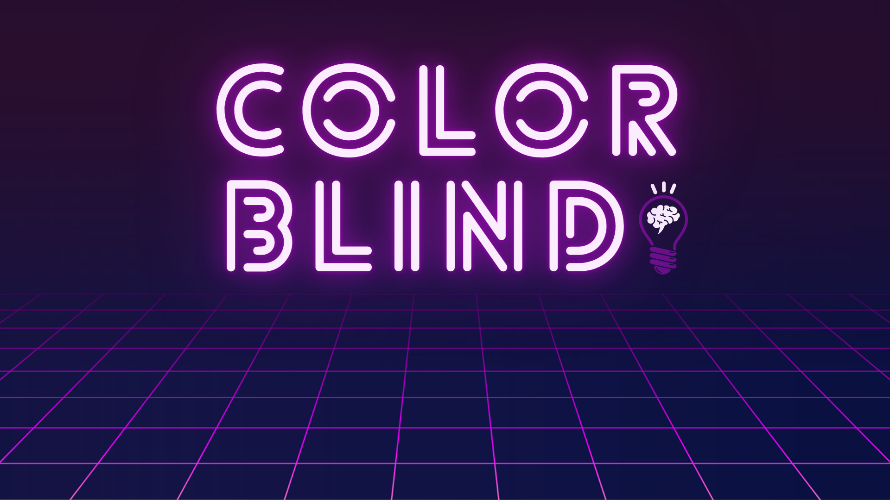

# Color Blind
Jogo 2D de puzzle para ser jogado no navegador em desktop.

# Informações
LIGHT UP! Liga todas as lâmpadas pela sequência correta.  

Jogo desenvolvido no âmbito da unidade curricular de
Programação e Desenvolvimento Web,
realizado no Instituto Politécnico do Cávado e do Ave.  

Equipa: 
- Luís Pereira 
- Vânia Pereira  

Barcelos, Janeiro 2023 
© Direitos reservados.

# Configurações

### `npm install`
Instalar pacotes e dependências do projeto.

### `npm start`
Iniciar projeto localmente.

### `npm run build`
Fazer build do projeto para produção.

### `npm test`
Iniciar testes.
